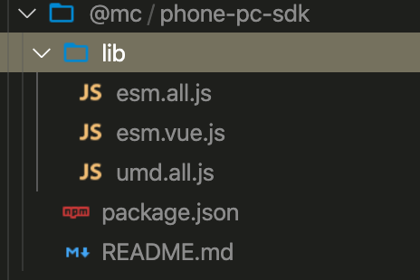
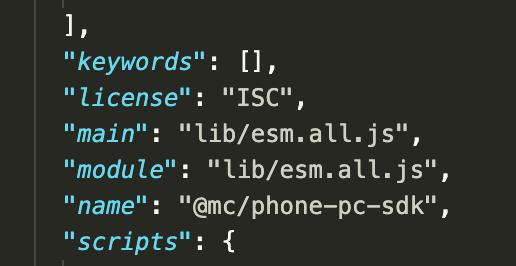
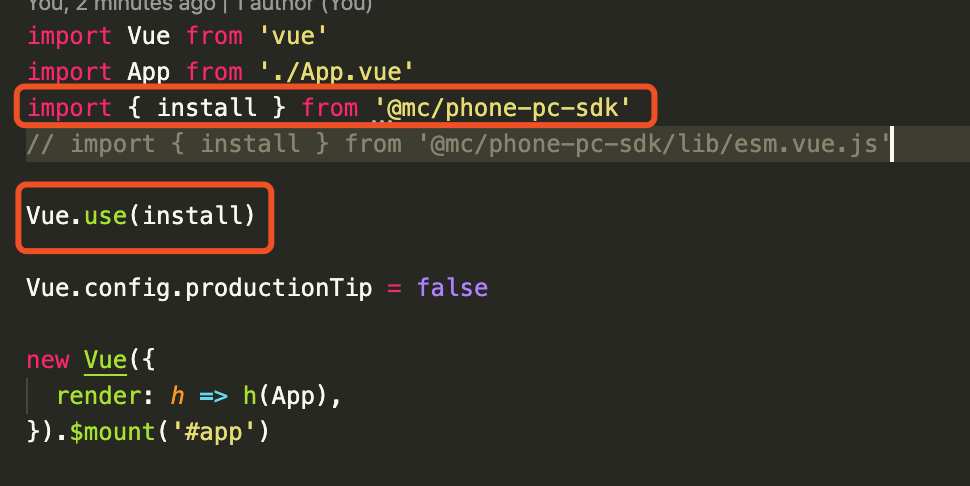
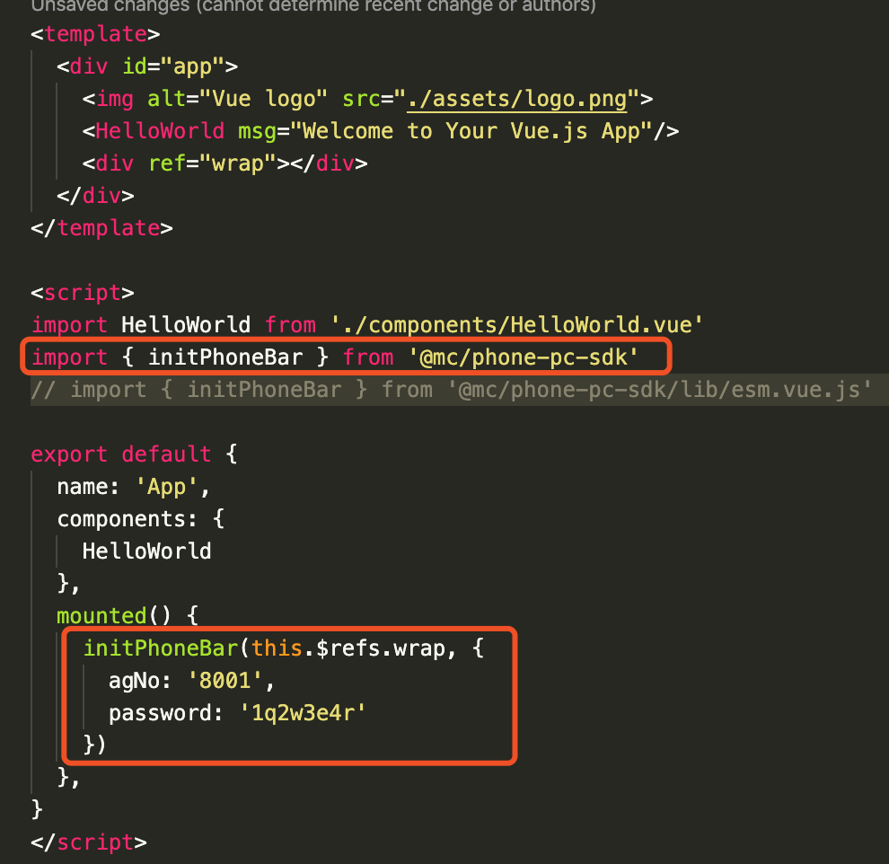
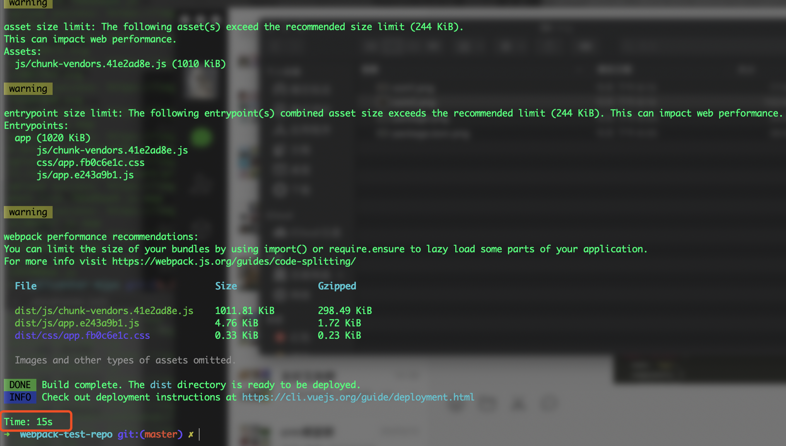
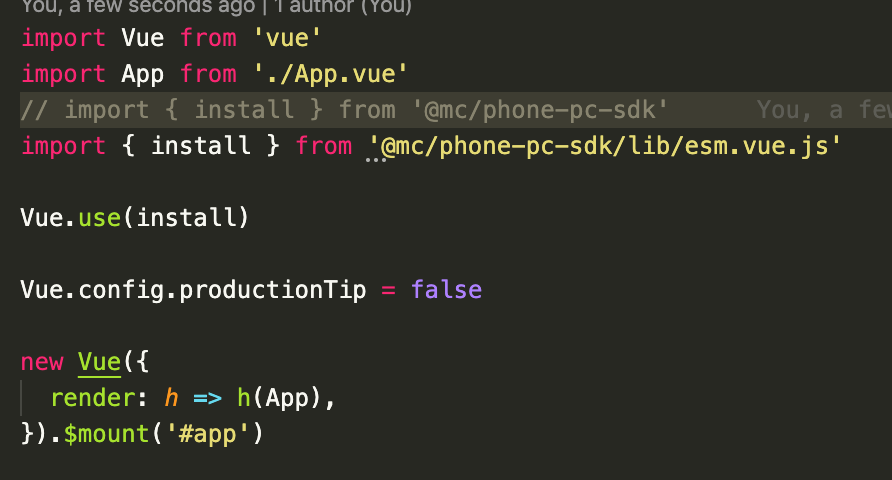
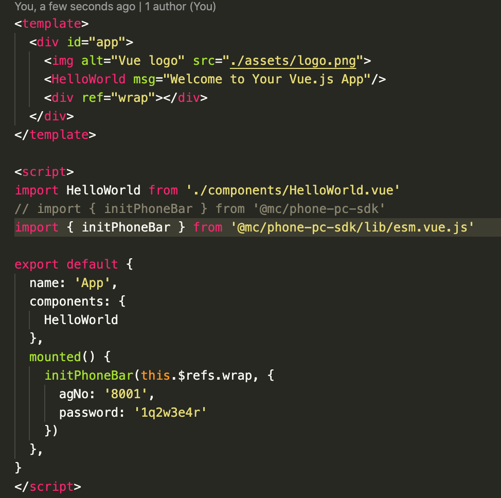
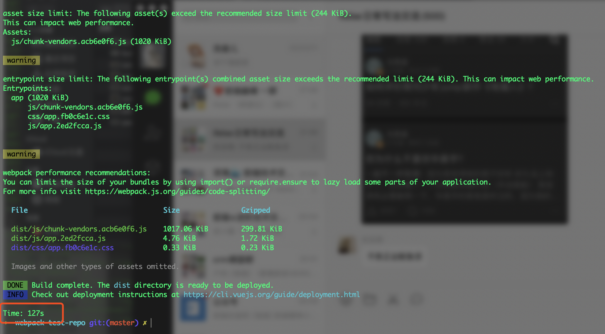

# webpack-test-repo

## description

### My npm package has three types of products:

and `package.json`:

> As can be seen from the above figure, the default export is esm.all.js

> The only difference between esm.vue.js and esm.all.js is that the former excludes the vue library

### Let see when it is normal

I imported this package in two places

- - - 

then I run `npm run build`, the build result `15s`:

### Let see when it is slowly

change the two file to below:

- - - 

then I run `npm run build`, the build result `127s`:

